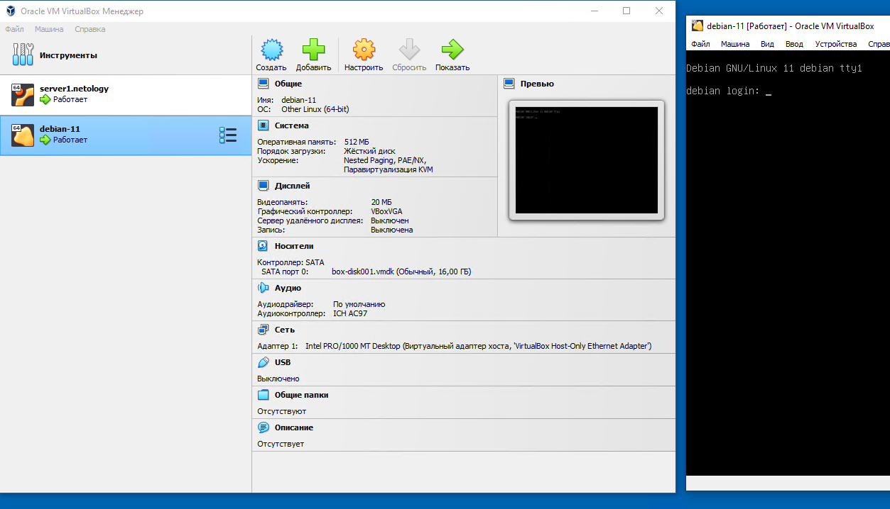

# Домашнее задание к занятию «Введение в Terraform»

1. **Приложите скриншот вывода команды** `terraform --version`.

```
root@server1:/home/vagrant/Netology/DevOps/ter-homeworks/01/src# terraform --version
Terraform v1.4.6
on linux_amd64
root@server1:/home/vagrant/Netology/DevOps/ter-homeworks/01/src#
```

**В каком terraform файле согласно этому .gitignore допустимо сохранить личную, секретную информацию?**

Ответ: В файле **personal.auto.tfvars**

**Найдите в State-файле секретное содержимое созданного ресурса random_password, пришлите в качестве ответа конкретный ключ и его значение.**
   
```
"result": "Tdu3IOJ4NNd8I9Hu"
```

**Объясните в чем заключаются намеренно допущенные ошибки? Исправьте их.**

Ошибка:
 ```
│ Error: Missing name for resource
│
│   on main.tf line 23, in resource "docker_image":
│   23: resource "docker_image" {
│
│ All resource blocks must have 2 labels (type, name).
╵
```

Эта ошибка обозначает, что пропущена вторая метка в описании ресурса **docker_image**. Правильно будет написать так:
   
```
resource "docker_image" "nginx" {
```

Ошибка:
```
│ Error: Invalid resource name
│
│   on main.tf line 28, in resource "docker_container" "1nginx":
│   28: resource "docker_container" "1nginx" {
│
│ A name must start with a letter or underscore and may contain only letters, digits, underscores, and dashes.
```

Эта ошибка обозначает, что имя в описании ресурса **docker_container** должно начинаться с буквы. Правильно будет написать так:

```
resource "docker_container" "nginx" {
```

Ошибка:
```
│ Error: Reference to undeclared resource
│
│   on main.tf line 30, in resource "docker_container" "nginx":
│   30:   name  = "example_${random_password.random_string_fake.resuld}"
│
│ A managed resource "random_password" "random_string_fake" has not been declared in the root module.
```

Эта ошибка обозначает, что ресурс **random_string_fake** не был определён. Правильно будет написать так:

```
name  = "example_${random_password.random_string.resuld}"
```

Ошибка:
```
│ Error: Unsupported attribute
│
│   on main.tf line 30, in resource "docker_container" "nginx":
│   30:   name  = "example_${random_password.random_string.resuld}"
│
│ This object has no argument, nested block, or exported attribute named "resuld". Did you mean "result"?
```

Эта ошибка обозначает, что объект **random_password.random_string** не имеет аттрибута **resuld**. Правильно будет написать так:

```
name  = "example_${random_password.random_string.result}"
```

**Выполните код. В качестве ответа приложите вывод команды** `docker ps`

```
vagrant@server1:~/Netology/DevOps/ter-homeworks/01/src$ docker ps
CONTAINER ID   IMAGE                  COMMAND                  CREATED         STATUS           PORTS                   NAMES
cb7ce9d39b8c   448a08f1d2f9           "/docker-entrypoint.…"   2 minutes ago   Up 2 minutes     0.0.0.0:8000->80/tcp    example_Tdu3IOJ4NNd8I9Hu
vagrant@server1:~/Netology/DevOps/ter-homeworks/01/src$
```

**Объясните своими словами, в чем может быть опасность применения ключа -auto-approve ?**

Ответ: Опция **--auto-approve** пропускает интерактивное подтвержнение плана перед применением. Опасность её использования заключается в увеличении вероятности внесения необдуманных изменений.

**В качестве ответа дополнительно приложите вывод команды** `docker ps`

```
vagrant@server1:~/Netology/DevOps/ter-homeworks/01/src$ docker ps
CONTAINER ID   IMAGE     COMMAND   CREATED   STATUS    PORTS     NAMES
vagrant@server1:~/Netology/DevOps/ter-homeworks/01/src$
```

**Уничтожьте созданные ресурсы с помощью terraform. Убедитесь, что все ресурсы удалены. Приложите содержимое файла terraform.tfstate.**

```
vagrant@server1:~/Netology/DevOps/ter-homeworks/01/src$ cat terraform.tfstate
{
  "version": 4,
  "terraform_version": "1.4.6",
  "serial": 20,
  "lineage": "a1c2d225-0173-020b-5f61-70ec9fe7029a",
  "outputs": {},
  "resources": [],
  "check_results": null
}
vagrant@server1:~/Netology/DevOps/ter-homeworks/01/src$
```

**Объясните, почему при этом не был удален docker образ nginx:latest ? Ответ подкрепите выдержкой из документации провайдера.**

Ответ: Образ не был удалён, так как параметр **keep_locally** установлен в значение **true**:
```
keep_locally (Boolean) If true, then the Docker image won't be deleted on destroy
operation. If this is false, it will delete the image from the docker local storage on destroy
operation.
```

2. **Создайте с его помощью любую виртуальную машину. В качестве ответа приложите plan для создаваемого ресурса и скриншот созданного в VB ресурса.**

```
C:\CODE\Netology\ter-homeworks\01\src>terraform plan

Terraform used the selected providers to generate the following execution plan. Resource actions are indicated with the following symbols:
  + create

Terraform will perform the following actions:

  # virtualbox_vm.vm1 will be created
  + resource "virtualbox_vm" "vm1" {
      + cpus   = 1
      + id     = (known after apply)
      + image  = "https://app.vagrantup.com/shekeriev/boxes/debian-11/versions/0.2/providers/virtualbox.box"
      + memory = "512 mib"
      + name   = "debian-11"
      + status = "running"

      + network_adapter {
          + device                 = "IntelPro1000MTDesktop"
          + host_interface         = "VirtualBox Host-Only Ethernet Adapter"
          + ipv4_address           = (known after apply)
          + ipv4_address_available = (known after apply)
          + mac_address            = (known after apply)
          + status                 = (known after apply)
          + type                   = "hostonly"
        }
    }

Plan: 1 to add, 0 to change, 0 to destroy.

Changes to Outputs:
  + IPAddress = (known after apply)

─────────────────────────────────────────────────────────────────────────────────────────────────────────────────────────────────────────────
```


