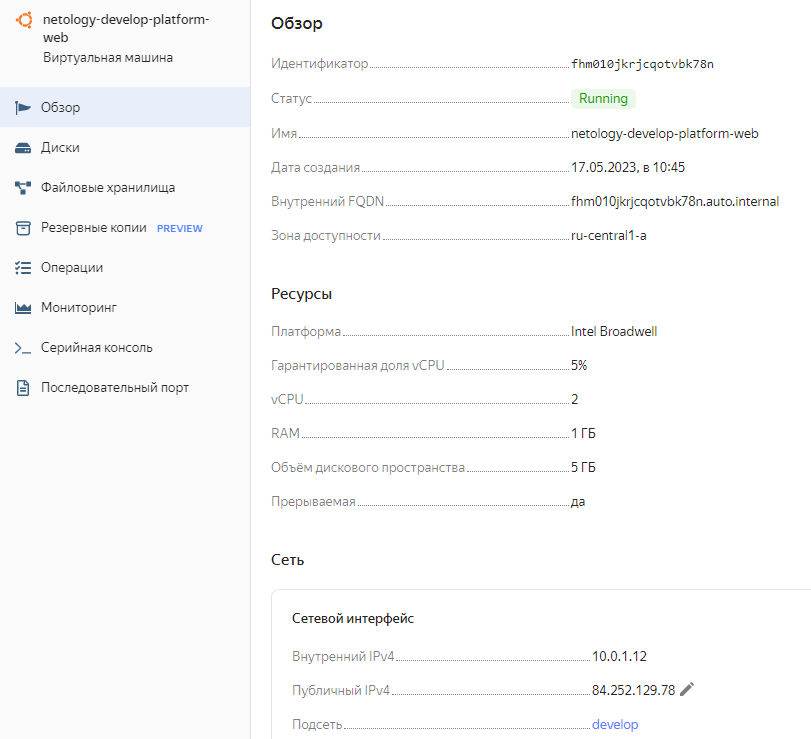
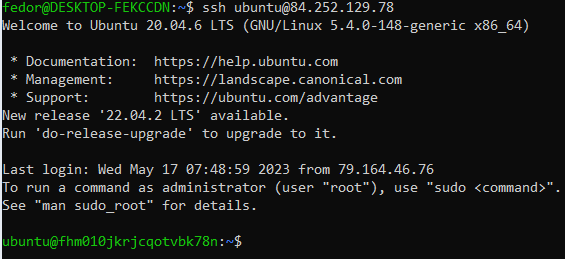

# Домашнее задание к занятию «Основы Terraform. Yandex Cloud»

1. **Инициализируйте проект, выполните код. Исправьте возникшую ошибку. Ответьте в чем заключается ее суть?**

    Ошибка:
```
│ Error: Error while requesting API to create instance:
server-request-id = 47f791bc-f09c-4684-8471-06b2bb0f2ffd
server-trace-id = eb5fea3df357c7ca:81039b2881f1d4ee:eb5fea3df357c7ca:1)
client-request-id = 86d275f8-dafa-4c99-8123-a5c3f71c33c7
client-trace-id = a7b2109f-24a3-469f-86ab-b492f0f5db6f rpc
error: code = InvalidArgument
desc = the specified number of cores is not available on platform "standard-v1"; allowed core number: 2, 4
│
│   with yandex_compute_instance.platform,
│   on main.tf line 15, in resource "yandex_compute_instance" "platform":
│   15: resource "yandex_compute_instance" "platform" {
```

   Ответ: Ошибка обозначает, что нельзя создать ВМ с количеством ядер - **1**. Можно только с 2мя или 4мя ядрами.
    
**Ответьте, как в процессе обучения могут пригодиться параметры preemptible = true и core_fraction=5 в параметрах ВМ? Ответ в документации Yandex cloud.**

**Preemptible instances** — это экземпляры ВМ, которые могут быть остановлены в любое время. Это может произойти в двух случаях:
- Если с момента запуска экземпляра прошло 24 часа.
- Если недостаточно ресурсов для запуска обычного экземпляра в той же зоне доступности.
Вероятность остановки низкая, но меняется в зависимости от дня.

**core_fraction** - это часть процессорного времени физического процессора в процентах, которая доступна для виртуальной машины. **5** обозначает,
виртуальной машине физическое ядро доступно только 50 миллисекунд из каждой секунды.

В обучении такие параметры ВМ позволяют экономить деньги при создании учебных ВМ.

**В качестве решения приложите:**

- **скриншот ЛК Yandex Cloud с созданной ВМ,**


- **скриншот успешного подключения к консоли ВМ через ssh,**


4. **В качестве решения приложите вывод значений ip-адресов команды** `terraform output`
```
vagrant@server1:~/Netology/DevOps/ter-homeworks/02/src$ terraform output
external_ips = {
  "db_ip" = "158.160.61.204"
  "web_ip" = "84.252.129.78"
}
vagrant@server1:~/Netology/DevOps/ter-homeworks/02/src$
```
7. **Изучите содержимое файла console.tf. Откройте terraform console, выполните следующие задания:**

- **Напишите, какой командой можно отобразить второй элемент списка test_list?**
```
> local.test_list[1]
"staging"
>
```
- **Найдите длину списка test_list с помощью функции length(<имя переменной>).**
```
> length(local.test_list)
3
>
```
- **Напишите, какой командой можно отобразить значение ключа admin из map test_map?**
```
> local.test_map.admin
"John"
>
```
- **Напишите interpolation выражение, результатом которого будет: "John is admin for production server based on OS ubuntu-20-04 with X vcpu, Y ram and Z virtual disks", используйте данные из переменных test_list, test_map, servers и функцию length() для подстановки значений.**

```
> "${local.test_map.admin} is admin for ${local.test_list[2]} server based on OS ${local.servers.production.image} with ${local.servers.production.cpu} vcpu, ${local.servers.production.ram} ram and ${length(local.servers.production.disks)} virtual disks"
"John is admin for production server based on OS ubuntu-20-04 with 10 vcpu, 40 ram and 4 virtual disks"
>
```
